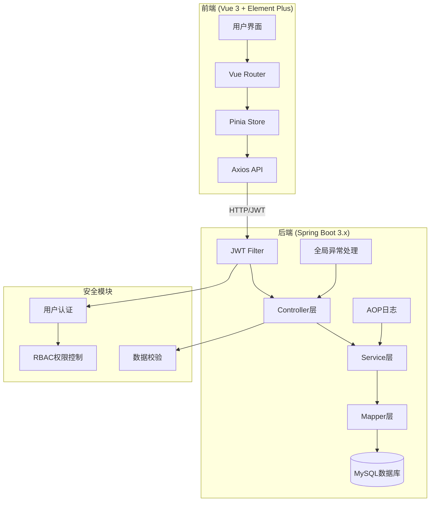
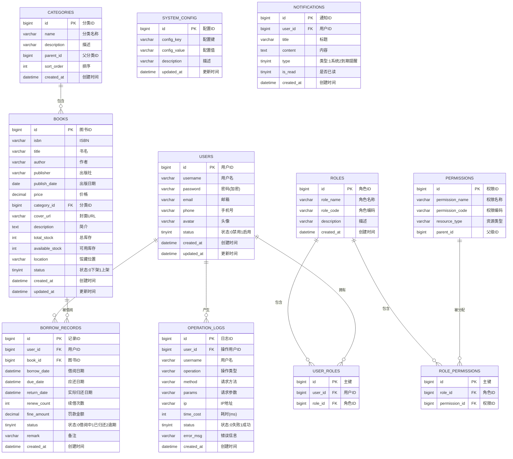

# 图书管理系统 - 项目设计文档

## 1. 系统架构



## 2. 数据库ER图



## 3. 接口清单

### 3.1 认证模块 (AuthController)
| 方法 | 路径 | 描述 |
|------|------|------|
| POST | /api/auth/login | 用户登录 |
| POST | /api/auth/register | 用户注册 |
| POST | /api/auth/logout | 退出登录 |
| GET | /api/auth/captcha | 获取验证码 |
| POST | /api/auth/refresh-token | 刷新Token |

### 3.2 用户模块 (UserController)
| 方法 | 路径 | 描述 |
|------|------|------|
| GET | /api/users | 分页查询用户列表 |
| GET | /api/users/{id} | 获取用户详情 |
| POST | /api/users | 新增用户 |
| PUT | /api/users/{id} | 更新用户信息 |
| DELETE | /api/users/{id} | 删除用户 |
| PUT | /api/users/{id}/status | 修改用户状态 |
| GET | /api/users/profile | 获取当前用户信息 |
| PUT | /api/users/profile | 更新当前用户信息 |
| PUT | /api/users/password | 修改密码 |

### 3.3 角色权限模块 (RoleController)
| 方法 | 路径 | 描述 |
|------|------|------|
| GET | /api/roles | 获取角色列表 |
| POST | /api/roles | 新增角色 |
| PUT | /api/roles/{id} | 更新角色 |
| DELETE | /api/roles/{id} | 删除角色 |
| GET | /api/roles/{id}/permissions | 获取角色权限 |
| PUT | /api/roles/{id}/permissions | 分配角色权限 |
| GET | /api/permissions | 获取权限树 |

### 3.4 图书分类模块 (CategoryController)
| 方法 | 路径 | 描述 |
|------|------|------|
| GET | /api/categories | 获取分类列表 |
| GET | /api/categories/tree | 获取分类树 |
| POST | /api/categories | 新增分类 |
| PUT | /api/categories/{id} | 更新分类 |
| DELETE | /api/categories/{id} | 删除分类 |

### 3.5 图书模块 (BookController)
| 方法 | 路径 | 描述 |
|------|------|------|
| GET | /api/books | 分页查询图书列表 |
| GET | /api/books/{id} | 获取图书详情 |
| POST | /api/books | 新增图书 |
| PUT | /api/books/{id} | 更新图书 |
| DELETE | /api/books/{id} | 删除图书 |
| POST | /api/books/import | 批量导入图书 |
| GET | /api/books/export | 导出图书 |
| POST | /api/books/{id}/stock | 库存调整 |
| GET | /api/books/stock-warning | 库存预警列表 |
| POST | /api/books/cover/upload | 上传封面 |

### 3.6 借阅模块 (BorrowController)
| 方法 | 路径 | 描述 |
|------|------|------|
| GET | /api/borrows | 分页查询借阅记录 |
| GET | /api/borrows/{id} | 获取借阅详情 |
| POST | /api/borrows | 借阅图书 |
| PUT | /api/borrows/{id}/return | 归还图书 |
| PUT | /api/borrows/{id}/renew | 续借图书 |
| GET | /api/borrows/my | 我的借阅记录 |
| GET | /api/borrows/overdue | 逾期列表 |
| GET | /api/borrows/statistics | 借阅统计 |

### 3.7 通知模块 (NotificationController)
| 方法 | 路径 | 描述 |
|------|------|------|
| GET | /api/notifications | 获取通知列表 |
| PUT | /api/notifications/{id}/read | 标记已读 |
| PUT | /api/notifications/read-all | 全部已读 |
| GET | /api/notifications/unread-count | 未读数量 |

### 3.8 系统管理模块 (SystemController)
| 方法 | 路径 | 描述 |
|------|------|------|
| GET | /api/system/logs | 操作日志列表 |
| GET | /api/system/config | 获取系统配置 |
| PUT | /api/system/config | 更新系统配置 |
| POST | /api/system/backup | 数据备份 |
| POST | /api/system/restore | 数据恢复 |
| GET | /api/system/dashboard | 仪表盘数据 |

## 4. UI/UX 规范

### 4.1 色彩体系
```scss
// 主色调
$primary-color: #409EFF;
$primary-light: #66B1FF;
$primary-dark: #337ECC;

// 功能色
$success-color: #67C23A;
$warning-color: #E6A23C;
$danger-color: #F56C6C;
$info-color: #909399;

// 中性色
$text-primary: #303133;
$text-regular: #606266;
$text-secondary: #909399;
$text-placeholder: #C0C4CC;

// 边框色
$border-base: #DCDFE6;
$border-light: #E4E7ED;
$border-lighter: #EBEEF5;
$border-extra-light: #F2F6FC;

// 背景色
$bg-color: #F5F7FA;
$bg-white: #FFFFFF;
$bg-page: #F0F2F5;
```

### 4.2 字体规范
```scss
// 字体家族
$font-family: -apple-system, BlinkMacSystemFont, 'Segoe UI', Roboto, 'Helvetica Neue', Arial, sans-serif;

// 字号
$font-size-large: 18px;
$font-size-medium: 16px;
$font-size-base: 14px;
$font-size-small: 13px;
$font-size-mini: 12px;

// 行高
$line-height-base: 1.5;
$line-height-loose: 1.7;
```

### 4.3 间距规范
```scss
// 间距基准值
$spacing-mini: 4px;
$spacing-small: 8px;
$spacing-base: 16px;
$spacing-medium: 24px;
$spacing-large: 32px;
```

### 4.4 圆角规范
```scss
$border-radius-small: 2px;
$border-radius-base: 4px;
$border-radius-medium: 8px;
$border-radius-large: 12px;
$border-radius-round: 20px;
```

### 4.5 阴影规范
```scss
$shadow-base: 0 2px 4px rgba(0, 0, 0, 0.12), 0 0 6px rgba(0, 0, 0, 0.04);
$shadow-light: 0 2px 12px 0 rgba(0, 0, 0, 0.1);
$shadow-medium: 0 4px 12px rgba(0, 0, 0, 0.15);
```

### 4.6 组件规范
- **卡片**: 白色背景 + 圆角8px + 轻阴影
- **按钮**: 圆角4px, 高度32px/36px/40px
- **表格**: 斑马纹, 行高48px
- **表单**: 标签宽度100px, 输入框高度36px
- **弹窗**: 圆角8px, 最大宽度600px

## 5. 项目结构

```
library-management-system/
├── backend/                          # 后端项目
│   ├── src/main/java/com/library/
│   │   ├── LibraryApplication.java   # 启动类
│   │   ├── common/                   # 公共模块
│   │   │   ├── base/                 # 基础类
│   │   │   ├── config/               # 配置类
│   │   │   ├── exception/            # 异常处理
│   │   │   ├── response/             # 统一响应
│   │   │   └── util/                 # 工具类
│   │   ├── security/                 # 安全模块
│   │   │   ├── jwt/                  # JWT相关
│   │   │   └── filter/               # 过滤器
│   │   ├── module/                   # 业务模块
│   │   │   ├── auth/                 # 认证模块
│   │   │   ├── user/                 # 用户模块
│   │   │   ├── role/                 # 角色模块
│   │   │   ├── book/                 # 图书模块
│   │   │   ├── category/             # 分类模块
│   │   │   ├── borrow/               # 借阅模块
│   │   │   ├── notification/         # 通知模块
│   │   │   └── system/               # 系统模块
│   │   └── aspect/                   # AOP切面
│   ├── src/main/resources/
│   │   ├── application.yml           # 配置文件
│   │   ├── mapper/                   # MyBatis映射文件
│   │   └── db/                       # 数据库脚本
│   ├── pom.xml
│   └── Dockerfile
├── frontend-admin/                   # 前端项目
│   ├── src/
│   │   ├── api/                      # API接口
│   │   ├── assets/                   # 静态资源
│   │   ├── components/               # 公共组件
│   │   ├── layouts/                  # 布局组件
│   │   ├── router/                   # 路由配置
│   │   ├── stores/                   # Pinia状态
│   │   ├── styles/                   # 全局样式
│   │   ├── utils/                    # 工具函数
│   │   ├── views/                    # 页面组件
│   │   ├── App.vue
│   │   └── main.ts
│   ├── package.json
│   ├── vite.config.ts
│   └── Dockerfile
├── docker-compose.yml
├── .gitignore
└── README.md
```
